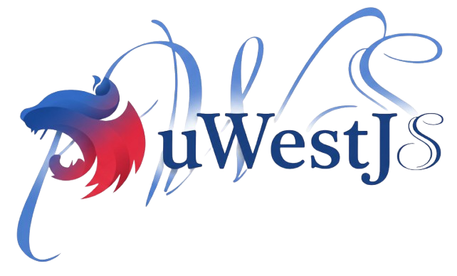

<p align="center">
  
</p>

# uWestJS

> High-performance HTTP and WebSocket platform adapter for NestJS using uWebSockets.js

[](https://opensource.org/licenses/MIT)
[](https://nodejs.org)
[](https://www.codefactor.io/repository/github/fossforge/uwestjs)

uWestJS is a high-performance platform adapter for NestJS, powered by [uWebSockets.js](https://github.com/uNetworking/uWebSockets.js). It provides both HTTP and WebSocket capabilities with significantly better performance while maintaining full compatibility with NestJS decorators and patterns you already know.

## Why uWestJS?

uWebSockets.js is one of the fastest HTTP and WebSocket implementations available, offering:

- **Up to 10x faster** than Express and traditional WebSocket libraries in benchmarks
- **Lower memory footprint** for handling thousands of concurrent connections
- **Native backpressure handling** to prevent memory issues under load
- **Built-in compression** support for reduced bandwidth usage
- **Streaming support** with automatic backpressure management

uWestJS brings this performance to NestJS without requiring you to change your existing code.

## Documentation

### WebSocket Documentation
- [Adapter](./docs/websocket/Adapter.md) - UwsAdapter configuration and methods
- [Socket API](./docs/websocket/Socket.md) - UwsSocket properties and methods
- [Broadcasting](./docs/websocket/Broadcasting.md) - BroadcastOperator and broadcasting patterns
- [Decorators](./docs/websocket/Decorators.md) - NestJS WebSocket decorators
- [Rooms](./docs/websocket/Rooms.md) - Room operations and patterns
- [Middleware](./docs/websocket/Middleware.md) - Guards, Pipes, and Filters
- [Exceptions](./docs/websocket/Exceptions.md) - WsException and error handling
- [Lifecycle](./docs/websocket/Lifecycle.md) - Gateway lifecycle management

### HTTP Documentation
- [Server](./docs/http/Server.md) - Server setup and configuration
- [Request](./docs/http/Request.md) - HTTP request object and methods
- [Response](./docs/http/Response.md) - HTTP response object and methods
- [Routing](./docs/http/Routing.md) - Route registration and path parameters
- [Middleware](./docs/http/Middleware.md) - Guards, Pipes, Filters, and Interceptors
- [Body Parsing](./docs/http/Body-Parsing.md) - JSON, form data, and more
- [Multipart](./docs/http/Multipart.md) - File uploads and multipart forms
- [Compression](./docs/http/Compression.md) - Request/response compression
- [CORS](./docs/http/CORS.md) - Cross-origin resource sharing
- [Static Files](./docs/http/Static-Files.md) - Static file serving

## Features

### HTTP Features
- **High Performance** - Up to 10x faster than Express for HTTP requests → [Server Documentation](./docs/http/Server.md)
- **Request Handling** - Full Express-compatible request API with body parsing, headers, cookies, and more → [Request API](./docs/http/Request.md)
- **Response Handling** - Comprehensive response methods including streaming, compression, and caching → [Response API](./docs/http/Response.md)
- **Routing** - Path parameters, wildcards, and route registration → [Routing Guide](./docs/http/Routing.md)
- **Body Parsing** - Automatic parsing for JSON, URL-encoded, multipart, raw, and text → [Body Parsing](./docs/http/Body-Parsing.md)
- **File Uploads** - Multipart form data and file upload handling → [Multipart Guide](./docs/http/Multipart.md)
- **Static Files** - Advanced static file serving with caching, range requests, and ETag support → [Static Files](./docs/http/Static-Files.md)
- **Middleware** - Full support for Guards, Pipes, Filters, and Interceptors → [HTTP Middleware](./docs/http/Middleware.md)
- **Compression** - Request and response compression support → [Compression](./docs/http/Compression.md)
- **CORS** - Flexible cross-origin resource sharing configuration → [CORS Configuration](./docs/http/CORS.md)

### WebSocket Features
- **NestJS Compatibility** - Full support for `@SubscribeMessage`, `@MessageBody`, `@ConnectedSocket` decorators → [Decorators](./docs/websocket/Decorators.md)
- **Room Management** - Efficient room-based broadcasting and client organization → [Rooms Guide](./docs/websocket/Rooms.md)
- **Broadcasting** - Powerful broadcasting operators for targeted message distribution → [Broadcasting](./docs/websocket/Broadcasting.md)
- **Middleware Support** - Guards, Pipes, and Filters for WebSocket handlers → [WebSocket Middleware](./docs/websocket/Middleware.md)
- **Lifecycle Management** - Gateway lifecycle hooks and connection management → [Lifecycle](./docs/websocket/Lifecycle.md)
- **Exception Handling** - WsException and error handling patterns → [Exceptions](./docs/websocket/Exceptions.md)
- **Backpressure Handling** - Automatic message queuing when clients are slow
- **CORS Configuration** - Built-in CORS support for WebSocket connections
- **Compression** - Per-message deflate compression support

### General Features
- **TypeScript Support** - Full type definitions and TypeScript-first design
- **Dependency Injection** - Full NestJS DI support for all middleware
- **Shared or Separate Ports** - Run HTTP and WebSocket on the same port or separate ports
- **Production Ready** - Comprehensive test coverage and battle-tested in production

## Installation

```bash
npm install uwestjs
```

Or using yarn:

```bash
yarn add uwestjs
```

Or using pnpm:

```bash
pnpm add uwestjs
```

## Requirements

- Node.js 24 or 25
- NestJS >= 11.0.0
- TypeScript >= 6.0.0

### Note
- Supported Node.js versions: 24, 25
- If you experience installation or runtime issues, run `npm cache clean --force` before installing


## Quick Start

### HTTP Server

```typescript
import { NestFactory } from '@nestjs/core';
import { UwsPlatformAdapter } from 'uwestjs';
import { AppModule } from './app.module';

async function bootstrap() {
  const adapter = new UwsPlatformAdapter();
  const app = await NestFactory.create(AppModule, adapter);
  
  await app.init();
  adapter.listen(3000, () => {
    console.log('HTTP server running on port 3000');
  });
}
bootstrap();
```

See [Server Documentation](./docs/http/Server.md) for detailed setup instructions.

### WebSocket Server

```typescript
import { NestFactory } from '@nestjs/core';
import { UwsAdapter } from 'uwestjs';
import { AppModule } from './app.module';

async function bootstrap() {
  const app = await NestFactory.create(AppModule);
  
  const adapter = new UwsAdapter(app, { port: 8099 });
  app.useWebSocketAdapter(adapter);
  
  // Replace YourGateway with your actual gateway class
  const gateway = app.get(YourGateway);
  adapter.registerGateway(gateway);
  
  await app.listen(3000);
}
bootstrap();
```

See [Adapter Documentation](./docs/websocket/Adapter.md) for detailed setup instructions.

### HTTP + WebSocket (Shared Port)

```typescript
import { NestFactory } from '@nestjs/core';
import { UwsPlatformAdapter, UwsAdapter } from 'uwestjs';
import { AppModule } from './app.module';

async function bootstrap() {
  const httpAdapter = new UwsPlatformAdapter();
  const app = await NestFactory.create(AppModule, httpAdapter);
  
  const wsAdapter = new UwsAdapter(app, { 
    uwsApp: httpAdapter.getHttpServer(),
    path: '/ws'
  });
  app.useWebSocketAdapter(wsAdapter);
  
  // Replace YourGateway with your actual gateway class
  const gateway = app.get(YourGateway);
  wsAdapter.registerGateway(gateway);
  
  await app.init();
  httpAdapter.listen(3000, () => {
    console.log('HTTP and WebSocket running on port 3000');
  });
}
bootstrap();
```

See [Server Documentation](./docs/http/Server.md) for more deployment patterns.

## Configuration

### HTTP Configuration

Configure the HTTP platform adapter with SSL, compression, and more:

```typescript
const adapter = new UwsPlatformAdapter({
  key_file_name: 'key.pem',
  cert_file_name: 'cert.pem',
});
```

See [Server Documentation](./docs/http/Server.md) for all configuration options.

### WebSocket Configuration

Configure the WebSocket adapter with compression, timeouts, CORS, and more:

```typescript
import * as uWS from 'uWebSockets.js';

const adapter = new UwsAdapter(app, {
  port: 8099,
  path: '/ws',
  maxPayloadLength: 16384,
  idleTimeout: 60,
  compression: uWS.SHARED_COMPRESSOR,
  cors: {
    origin: 'https://example.com',
    credentials: true,
  },
});
```

See [Adapter Documentation](./docs/websocket/Adapter.md) for all configuration options.

### CORS Configuration

Both HTTP and WebSocket support flexible CORS configuration:

- Specific origins (recommended for production)
- Multiple origins
- Dynamic origin validation
- Credentials support

See [HTTP CORS](./docs/http/CORS.md) and [Adapter Documentation](./docs/websocket/Adapter.md) for details.

### Middleware Configuration

Enable dependency injection for Guards, Pipes, and Filters:

```typescript
import { ModuleRef } from '@nestjs/core';

const moduleRef = app.get(ModuleRef);
const adapter = new UwsAdapter(app, {
  port: 8099,
  moduleRef,
});
```

See [HTTP Middleware](./docs/http/Middleware.md) and [WebSocket Middleware](./docs/websocket/Middleware.md) for usage patterns.

## Usage Guides

### HTTP Usage
- [Request Handling](./docs/http/Request.md) - Access headers, query params, body, cookies
- [Response Methods](./docs/http/Response.md) - Send JSON, HTML, files, streams
- [Routing](./docs/http/Routing.md) - Define routes with path parameters
- [Body Parsing](./docs/http/Body-Parsing.md) - Parse JSON, form data, multipart
- [File Uploads](./docs/http/Multipart.md) - Handle file uploads
- [Static Files](./docs/http/Static-Files.md) - Serve static assets
- [Middleware](./docs/http/Middleware.md) - Use Guards, Pipes, Filters, Interceptors
- [Compression](./docs/http/Compression.md) - Enable compression
- [CORS](./docs/http/CORS.md) - Configure cross-origin requests

### WebSocket Usage
- [Decorators](./docs/websocket/Decorators.md) - Use `@SubscribeMessage`, `@MessageBody`, `@ConnectedSocket`
- [Rooms](./docs/websocket/Rooms.md) - Organize clients into rooms
- [Broadcasting](./docs/websocket/Broadcasting.md) - Send messages to multiple clients
- [Middleware](./docs/websocket/Middleware.md) - Use Guards, Pipes, Filters
- [Lifecycle](./docs/websocket/Lifecycle.md) - Handle connection/disconnection events
- [Exceptions](./docs/websocket/Exceptions.md) - Handle errors gracefully

### API Reference
- [UwsPlatformAdapter API](./docs/http/Server.md) - HTTP platform adapter methods
- [UwsAdapter API](./docs/websocket/Adapter.md) - WebSocket adapter methods
- [UwsSocket API](./docs/websocket/Socket.md) - Socket instance methods
- [BroadcastOperator API](./docs/websocket/Broadcasting.md) - Broadcasting methods
- [Request API](./docs/http/Request.md) - HTTP request methods
- [Response API](./docs/http/Response.md) - HTTP response methods

## Migration Guides

### From Express

Key differences when migrating from Express:

1. Use `UwsPlatformAdapter` instead of Express adapter
2. Initialize with `app.init()` then `adapter.listen()` instead of `app.listen()`
3. Most Express APIs work the same (req, res, middleware)

See [Server Documentation](./docs/http/Server.md) for detailed migration guide.

### From Socket.IO

Key differences when migrating from Socket.IO adapter:

1. Use `UwsAdapter` instead of `IoAdapter`
2. Register gateways with `adapter.registerGateway(gateway)`
3. All NestJS decorators work the same way

See [Adapter Documentation](./docs/websocket/Adapter.md) for detailed migration guide.

## Performance

uWestJS provides significant performance improvements:

- **HTTP**: Up to 10x faster than Express
- **WebSocket**: Up to 10x faster than Socket.IO
- **Memory**: Lower memory footprint for concurrent connections
- **Backpressure**: Automatic handling prevents memory issues
- **Compression**: Built-in support reduces bandwidth usage

For performance tips and benchmarks, see [Server Documentation](./docs/http/Server.md).

## Contributing

Contributions are welcome! Please feel free to submit a Pull Request.

1. Fork the repository
2. Create your feature branch (`git checkout -b feature/amazing-feature`)
3. Commit your changes (`git commit -m 'Add some amazing feature'`)
4. Push to the branch (`git push origin feature/amazing-feature`)
5. Open a Pull Request

## Testing

```bash
# Run all tests
npm test

# Run unit tests only
npm run test:unit

# Run integration tests only
npm run test:integration

# Run tests with coverage
npm run test:cov

# Run tests in watch mode
npm run test:watch
```

## Benchmarks

uWestJS delivers exceptional performance compared to traditional Node.js frameworks:

| Scenario | Express | Fastify | uWestJS | vs Express | vs Fastify |
|----------|---------|---------|---------|------------|------------|
| headers | 9.55k req/s | 8.85k req/s | **18.42k req/s** | **1.93x faster** | **2.08x faster** |
| hello-world | 10.58k req/s | 12.83k req/s | **22.77k req/s** | **2.15x faster** | **1.77x faster** |
| json-response | 10.18k req/s | 9.48k req/s | **18.75k req/s** | **1.84x faster** | **1.98x faster** |
| mixed-response | 9.60k req/s | 8.01k req/s | **24.62k req/s** | **2.57x faster** | **3.07x faster** |
| post-json | 10.60k req/s | 12.70k req/s | **45.38k req/s** | **4.28x faster** | **3.57x faster** |
| query-params | 9.08k req/s | 12.45k req/s | **19.88k req/s** | **2.19x faster** | **1.60x faster** |
| route-params | 10.67k req/s | 12.04k req/s | **18.77k req/s** | **1.76x faster** | **1.56x faster** |
| static-file | 10.42k req/s | 12.96k req/s | **21.39k req/s** | **2.05x faster** | **1.65x faster** |

**Average improvement: 1.56x-4.28x faster** across all scenarios.

**Test Environment:**
- CPU: AMD Ryzen 7 7730U (2.00 GHz, 8 cores)
- RAM: 16 GB
- OS: Windows 11 with WSL2 (Ubuntu)
- Node.js: v24.x
- Duration: 20s per scenario

Run benchmarks yourself:

```bash
# Quick benchmark (10s per scenario)
npm run benchmark:quick

# Full benchmark (20s per scenario, saves results)
npm run benchmark

# Test benchmark setup
npm run benchmark:test
```

Or from the benchmarks directory:

```bash
cd benchmarks
npm install
npm run benchmark:quick
```

See [benchmarks/README.md](benchmarks/README.md) for detailed information about metrics collected, historical tracking, and CI/CD integration.

## License

This project is licensed under the MIT License - see the [LICENSE](LICENSE) file for details.

## Acknowledgments

- Built on top of [uWebSockets.js](https://github.com/uNetworking/uWebSockets.js)
- Designed for [NestJS](https://nestjs.com/)
- Inspired by the NestJS community's need for high-performance WebSocket solutions

## Support

- GitHub Issues: [Report a bug](https://github.com/FOSSFORGE/uWestJS/issues)
- GitHub Discussions: [Ask questions](https://github.com/FOSSFORGE/uWestJS/discussions)

## Author

Vikram Aditya

## Organization

Part of [FOSS FORGE](https://github.com/FOSSFORGE) - Open Source Tools & Libraries

## Links

- [GitHub Repository](https://github.com/FOSSFORGE/uWestJS)
- [npm Package](https://www.npmjs.com/package/uwestjs)
- [NestJS Documentation](https://docs.nestjs.com/websockets/gateways)
- [uWebSockets.js](https://github.com/uNetworking/uWebSockets.js)
